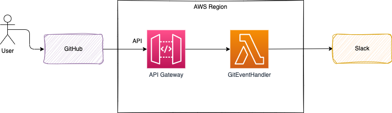
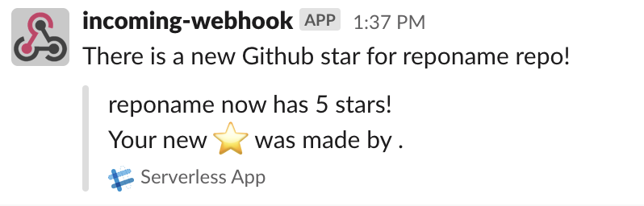
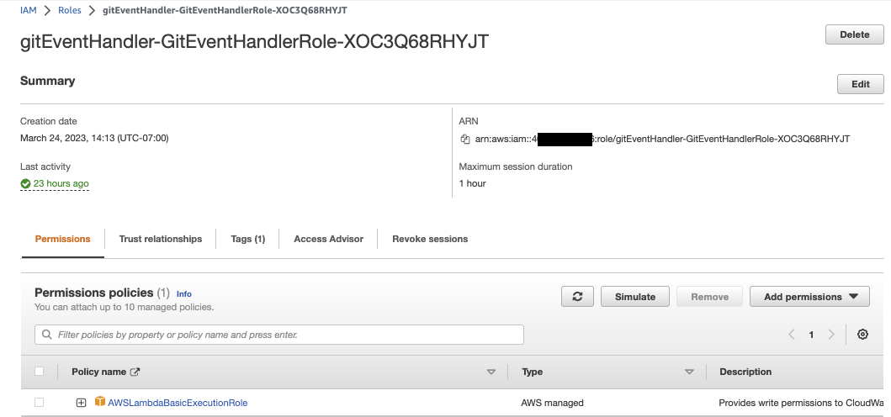
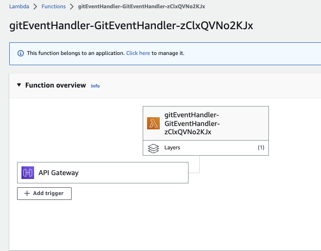
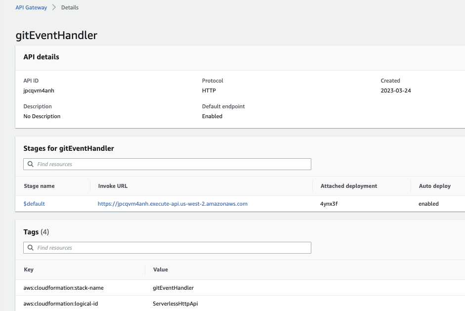

# From Git Event to Slack via AWS Serverless

This sample is to illutrate the use of AWS SAM, and Lambda, API Gateway, Webhook and Slack. It is based on this [set of articles](https://aws.amazon.com/blogs/compute/getting-started-with-serverless-for-developers-part-1/) but using the following difference:

* Python based lambda with an unique function to support the business logic of supporting different event types
* Use a coarse grained API where all the git events are managed by a single Function. This is more inline with domain driven design and EDA design: the domain is the Software Configuration Management (GitHub), Aggregate is GitCommand, and events are at least CodePushed, StarAdded, ForkHappened.... 
* Still using API Gateway to present a webhook to Git
* SAM focus

The architecture looks like in the following diagram:



## Development steps

* Set up the Slack Webhook URL for my personal slack account. Test the API by posting a simple message using curl:

    ```sh
    curl -X POST  https://hooks.slack.com/services/T4D.... -H 'Content-type: application/json' --data '{"text": "This is a line of text in a channel.\nAnd this is another line of text."}'
    ```

* Create the with sam, hello world template as it includes also API gateway for python

    ```sh
    sam init --runtime python3.9 --dependency-manager pip --app-template hello-world --name gitEventHandler
    ```

* Change to `src` folder to keep lambda function
* Modify code to use `requests` library, env variable and json. Add a method to call Slack WebHook.

    ```python
    def send_slack_message(payload):
        webhook = os.environ.get("SLACK_WEBHOOK")
        return requests.post(webhook, json.dumps(payload))
    ```

* Install dependencies

    ```sh
    pip3 install -r requirements.txt 
    ```

* Unit testing can be done with the following command in one terminal:

    ```sh
    export SLACK_WEBHOOK=....
    sam local start-api --port 8080
    ```

    And in another terminal:

    ```sh
    curl -X POST http://localhost:8080/ -H 'Content-type: application/json' -d @events/unittestevent.json
    ```

    As a result the Slack app should get the message.

    

* Deploy the application to AWS using SAM cli:

    ```sh
    sam build
    sam validate --lint
    sam deploy --guided
    ```

    Below is an example of input to enter:

    ```sh
    	Stack Name [sam-app]: gitEventHandler
	AWS Region [us-west-2]: 
	Parameter slackUrl []: https://hooks.slack.com/services/T4D....
	#Shows you resources changes to be deployed and require a 'Y' to initiate deploy
	Confirm changes before deploy [y/N]: y
	#SAM needs permission to be able to create roles to connect to the resources in your template
	Allow SAM CLI IAM role creation [Y/n]: y
	#Preserves the state of previously provisioned resources when an operation fails
	Disable rollback [y/N]: y
	GitEventHandler may not have authorization defined, Is this okay? [y/N]: y
	Save arguments to configuration file [Y/n]: 
	SAM configuration file [samconfig.toml]: 
	SAM configuration environment [default]: 
    ```

    The output is a Cloud Formation with the followng elements:

    ```
    GitEventHandlerGitEventsPermission  AWS::Lambda::Permission                      
    GitEventHandlerRole                 AWS::IAM::Role        -> to be able to write to CloudWatch
    GitEventHandler                     AWS::Lambda::Function 
    ServerlessHttpApiApiGatewayDefaultS AWS::ApiGatewayV2::Stage 
    ServerlessHttpApi                   AWS::ApiGatewayV2::Api 
    ```

    IAM Role with policy to write to CloudWatch:

    

    Lambda:

    

    API Gateway with API to proxy the Lambda function:

    

* Add the generated samconfig.toml to .gitignore as it contains secrets.
* If need to resynch the code

    ```sh
    sam sync --code --stack-name gitEventHandler
    ```